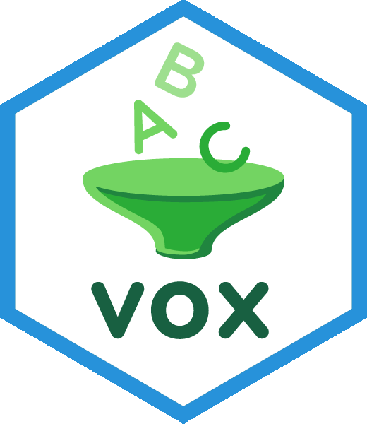
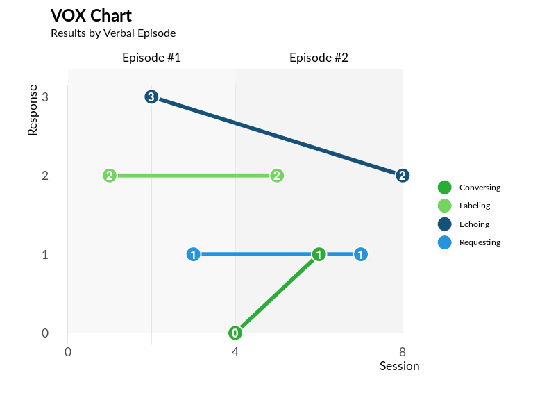

<!-- README.md is generated from README.Rmd. Please edit that file -->
<!-- badges: start -->

[](https://lifecycle.r-lib.org/articles/stages.html#experimental)
<!-- badges: end -->

<br>

## VOX Analysis Application & Package 

The `{voxanalysis}` package enables behavioral specialists to generate
detailed reports and analyses using the VOX Analysis framework, which
was designed to assess language development in individuals with autism.

<div style="display: flex; align-items: center;">

<div style="flex: 1; padding-right: 10px;">

<br>

<p>

#### Austism and the VOX Analysis

Autism spectrum disorder often presents unique language development
patterns.

For example, an individual with autism may excel at making requests but
struggle with responding to questions, whereas neurotypical individuals
tend to develop these skills more evenly.

Using the VOX Analysis Framework, the listener (i.e., the clinician) can
elicit verbal responses from the speaker (i.e., the patient) through
structured play-based interactions.

However, documenting these interactions alone does not lead to a
conclusive diagnosis.

Using the `{voxanalysis}` package, behavioral analysts can analyze
evaluation data to generate comprehensive reports, complete with data
visualizations and variance measures, offering insight into the
speaker’s language skills.

</p>

</div>

<div style="flex: 1; text-align: center;">


</div>

</div>

Developed by Dr. Lee Mason and Dr. Alonzo Andrews, co-founders of
Shapers at Work, `{voxanalysis}` is grounded in their expertise in
verbal behavior and autism assessment. Shapers at Work is a consulting
firm dedicated to training specialists in behavioral analysis and autism
diagnosis.

(Read more on the VOX Analysis process
[here](https://www.verbalbehavior.org/vox).)

<br> <br>

## Enterprise Deployment

Any R user can download and run the app using the `{voxanalysis}`
package. However, many clinics and behavioral specialists may not be
familiar with R. We recommending contacting either
<taylor.rodgers@freestateanalytics.com> or <leemason@gmail.com> for help
deploying or using application.

<br> <br>

## Installation

A user can install `{voxanalysis}` with:

``` r
## {devtools} package is required
install.packages("devtools")

devtools::install_github("Free-State-Analytics/voxanalysis", ref = "dev")
```

<br> <br>

## Running Reports

An R user can generate the interactive VOX Analysis Application with the
following:

``` r
voxanalysis::run_app()
```

For more experienced R users, they can generate an MS Word report with
the following:

``` r
# Load package
library(voxanalysis)

# Load example data for report generation
data("df_input_speaker_info_example")
data("df_input_response_example")

# Generate a Word document report
util_generate_word_doc_report(
  df_input_speaker_info = df_input_speaker_info_example,
  df_input_response = df_input_response_example,
  file_name = "text.docx"
)
```

To learn more about report generation, refer to the [How to Generate
Reports](https://free-state-analytics.github.io/voxanalysis/articles/generatingreports.html)
guide.

<br> <br>

## Generate Individual Data Visualizations and Calculations

Advanced R users can use the individual functions within `{voxanalysis}`
for data visualizations and calculations. These components are designed
to allow flexible analysis beyond the main VOX Analysis Application.

For example, a line chart that tracks language skill balance over verbal
episodes can be generated with:

``` r
library(voxanalysis)

# Load example data
data("df_input_response_example")

# Generate a VOX line chart across verbal episodes
plot_vox_line(
  df_input_response = df_input_response_example,
  ind_hide_heading = FALSE
  )
```

<br>



<br> <br>

For more details on available visualization and metric functions, see
[VOX Visualizations and
Metrics](https://free-state-analytics.github.io/voxanalysis/articles/datavizandcharts.html).

Advanced R users should also familiarize themselves with the [data
model](https://free-state-analytics.github.io/voxanalysis/articles/datamodel.html)
to use these functions appropriately.

<br> <br>

## About the Team

The `{voxanalysis}` package was developed by Lee Mason, Alonzo Andrews,
and Taylor Rodgers. It was a partnership between their respective
companies, Shapers at Work and Free State Analytics.

#### Lee Mason, PhD, BCBA-D, LBA-TX - VOX Analysis Researcher

Dr. Lee Mason is an Applied Behavior Analyst at Cook Children’s Health
Care System and an Associate Professor of Medical Education at the
Burnett School of Medicine, Texas Christian University. With over two
decades of experience, he has worked in a variety of settings, including
recreational, residential, educational, and clinical environments,
supporting individuals with disabilities.

Dr. Mason earned his special education teaching certificate from Stephen
F. Austin State University in 2004 and began his teaching career in
rural East Texas public schools. He later earned a PhD in Education from
Utah State University. His dissertation, *A Behavioral Phenomenological
Investigation of Multi-User Virtual Learning Environments*, was awarded
the Outstanding Paper honor by the Society for Information Technology
and Teacher Education.

Dr. Mason was on the faculty at the University of Texas at San Antonio
(UTSA) for eight years, where he taught courses on evidence-based
practices for students with autism. In 2013, he founded the UTSA Autism
Research Center, which received an Exemplary Program Award from the
American Council on Rural Special Education. His research on language
assessment and intervention for children with autism from diverse
cultural and linguistic backgrounds earned him the President’s
Distinguished Diversity Award at UTSA.

#### Alonzo Andrews, PhD, BCBA, LBA-TX - VOX Analysis Researcher

Dr. Alonzo Andrews served as the director of the Autism Treatment Center
in San Antonio for 24 years, where he led the delivery of behavioral
services for individuals with autism spectrum disorders. His work
included developing residential programs for children and adults,
operating a state-certified private school, and providing outpatient
rehabilitation therapies. Currently, he provides behavioral consultation
for a school district in San Antonio and has been teaching courses at
the University of Texas at San Antonio since 2013.

Alonzo has co-authored numerous publications in esteemed journals,
including *The Journal of Autism and Developmental Disorders*, The
*Analysis of Verbal Behavior*, and *Behavior Analysis in Practice*. His
clinical interests span a wide range of innovative projects, such as
biomedical interventions, video modeling, remote functional assessments,
autism-friendly architectural design, and challenging behavior
interventions. He has also worked on developing a computer-simulation
training program for caregivers of children with autism, reflecting his
commitment to advancing both research and practical applications in the
field.

#### Taylor Rodgers, MS - Project Manager & Package Developer

Taylor Rodgers is an analytics product developer and founder of Free
State Analytics.

Taylor has worked as a data scientist in a variety of industries ranging
from IT development, health care, senior living, marketing, and
manufacturing.

Taylor enjoys writing, statistics, programming, and learning about a
variety of subjects. This has given him a unique opportunity to
translate complexity into clarity with data related projects, as well as
being a reliable project manager where communication skills are
paramount.

Taylor has written two data science books, *Data Work: A Jargon-Free
Guide to Managing Successful Data Teams* and *R Programming in Plain
English.*

Taylor earned his Masters in Applied Statistics from the University of
Kansas Medical School and his Bachelors of Arts in Economics from the
University of Kansas.

<br> <br>

## Training and Consulting Services

**VOX Analysis Training**: Behavioral specialists can contact Lee Mason
(<leemason@gmail.com>) for training on using the VOX Analysis framework.

**VOX Analysis Setup & Support**: For assistance with setup or
customization of the VOX Analysis Application, contact Taylor Rodgers
(<taylor.rodgers@freestateanalytics.com>).

<br> <br> <br> <br>
