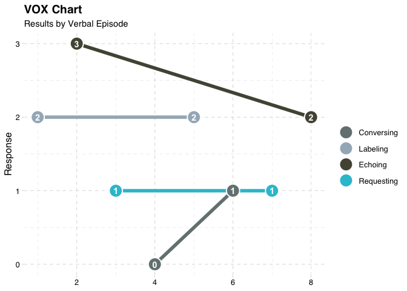

<!-- README.md is generated from README.Rmd. Please edit that file -->
<!-- badges: start -->

[](https://lifecycle.r-lib.org/articles/stages.html#experimental)
<!-- badges: end -->

# VOX Analysis Application & Package

**Note:** `{voxanalysis}` is currently under active development. Use it
at your own discretion.

The `{voxanalysis}` package provides tools for conducting and analyzing
autism diagnoses using the VOX Analysis framework.

Developed by Dr. Lee Mason and Dr. Alonzo Andrews, founders of Shapers
at Work, this package aids behavioral specialists by offering
visualizations and metrics for language development assessment in
individuals with autism.

<figure>

<figcaption aria-hidden="true">Placeholder Image</figcaption>
</figure>

## Background

The `{voxanalysis}` package enables behavioral specialists to generate
detailed reports and analyses using the VOX Analysis framework, which
was designed to assess language development in individuals with autism.

Developed by Dr. Lee Mason and Dr. Alonzo Andrews, co-founders of
Shapers at Work, `{voxanalysis}` is rooted in their expertise in verbal
behavior and autism diagnosis. Shapers at Work is a consulting firm
dedicated to training specialists in behavioral analysis and autism
assessment.

Autism spectrum disorder often presents unique language development
patterns. For instance, an individual with autism may excel at
requesting an object but struggle with responding to questions. In
contrast, people without autism typically exhibit balanced language
skills, where abilities like requesting and responding are more evenly
developed.

VOX Analysis leverages in-person evaluations (e.g., play therapy) to
measure these variations. During evaluations, a clinician (the
“listener”) elicits verbal responses from the individual (the
“speaker”). By documenting these interactions, clinicians can use
`{voxanalysis}` to produce comprehensive reports, complete with data
visualizations and variance measures, that offer insights into the
speaker’s language skills and patterns.

(Read more on the VOX Analysis process
[here](https://www.verbalbehavior.org/vox).)

## Installation

A user can install `{voxanalysis}` with:

``` r
devtools::install_github("Free-State-Analytics/voxanalysis")
```

## Running Reports

The easiest way to generate a report is by using the VOX Analysis
Application, a Shiny app included with {voxanalysis}.

To launch the application, run:

``` r
voxanalysis::run_app()
```

For users familiar with R, `{voxanalysis}` also supports generating a
report in MS Word format.

``` r
# Load example data for report generation
data("df_input_speaker_info_example")
data("df_input_response_example")

# Generate a Word document report
util_generate_word_doc_report(
  df_input_speaker_info = df_input_speaker_info_example,
  df_input_response = df_input_response_example,
  file_name = "text.docx"
)
```

To learn more about report generation, refer to the [How to Generate
Reports](https://free-state-analytics.github.io/voxanalysis/articles/generatingreports.html)
guide.

## Data Visualizations and Individual Metrics

Advanced R users can use the individual functions within `{voxanalysis}`
for data visualizations and calculations. These components are designed
to allow flexible analysis beyond the main VOX Analysis Application.

For example, a line chart that tracks language skill balance over verbal
episodes can be generated with:



For more details on available visualization and metric functions, see
[VOX Visualizations and
Metrics](https://free-state-analytics.github.io/voxanalysis/articles/datavizandcharts.html).

## About the Team

The `{voxanalysis}` package was developed by Lee Mason, Alonzo Andrews,
and Taylor Rodgers. It was a partnership between their respective
companies, Shapers at Work and Free State Analytics.

### Dr. Lee Mason - VOX Analysis Researcher

Dr. Mason is a behavioral specialist in verbal behavior and co-founder
of Shapers at Work. \[Bio coming soon\]

### Dr. Alonzo Andrews - VOX Analysis Researcher

Dr. Andrews is a behavioral specialist in verbal behavior and co-founder
of Shapers at Work. \[Bio coming soon\]

### Taylor Rodgers - Project Manager & Package Developer

Taylor Rodgers is the founder of Free State Analytics, a boutique
consulting firm specialized in R Shiny & package development. He is
available for R Shiny consulting and training. Contact
<taylor.rodgers@freestateanalytics.com>

## Training and Consulting Services

- **VOX Analysis Training**: Behavioral specialists can contact Lee
  Mason (<leemason@gmail.com>) for training on using the VOX Analysis
  framework.
- **VOX Analysis Setup & Support**: For assistance with setup or
  customization of the VOX Analysis Application, contact Taylor Rodgers
  (<taylor.rodgers@freestateanalytics.com>).
