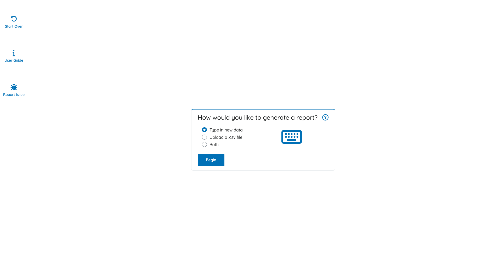
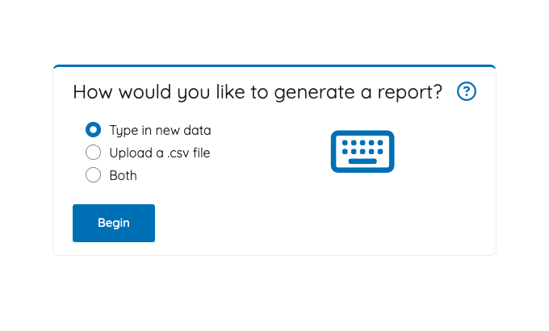
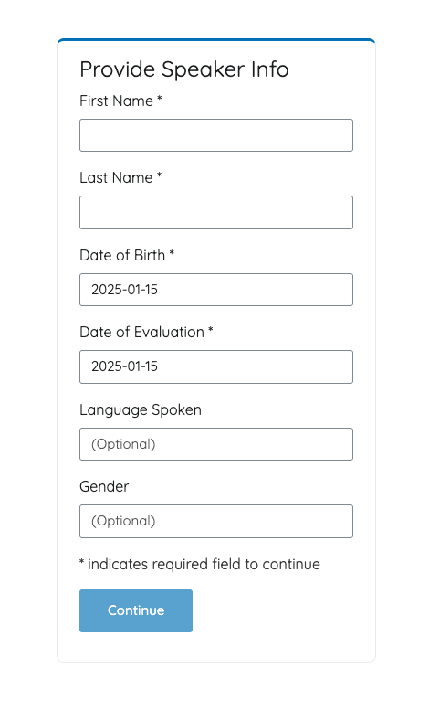
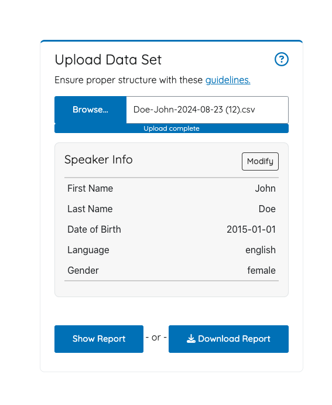
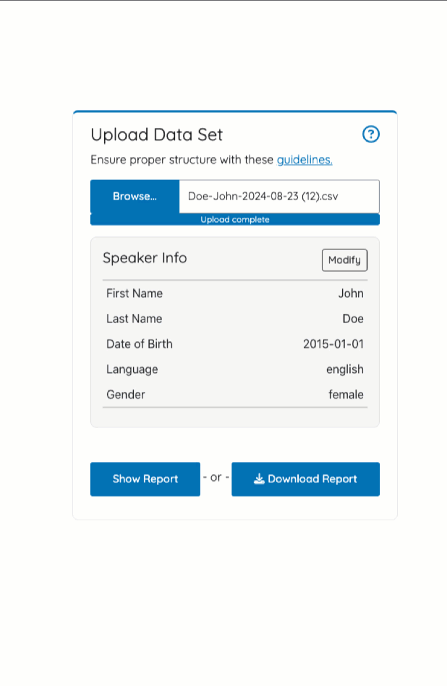
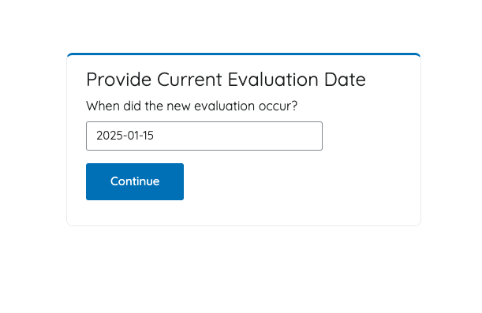
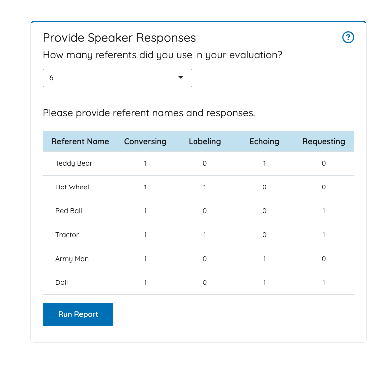

```{r, include = FALSE}
knitr::opts_chunk$set(
  collapse = TRUE,
  comment = "#>"
)
```

```{r setup}
library(voxanalysis)
```

The `voxanalysis` package provides the user two ways to generate a report:

-   The R Shiny application
-   Word Doc generation

We recommend non-R users rely on the R Shiny application. The application prmpts has built-in quality checks to ensure data quality and allows easy report generation.

R users who wish a Word Doc report without Shiny can follow the instructions [here](./generatingword.html).

Some R users may also want to create custom reports with the available data model, measures, and visualizations. They can use individual functions found [here](./datavizandcharts.html).

## R Shiny Application

To launch the application, simply run: `voxanalysis::run_app()`.

This will launch the home screen below:



### Select Data Upload Method

The first menu let's you decide how to enter the speaker's data. There are three options:

1.  **Type in new data**, which means you will manually type **both** the **speaker info** and then **response data** from the evaluation.
2.  **Upload a .csv file**, which allows you to re-run a report with previously exported data. This is also useful for those who want to generate a report with data filled out in a .csv.
3.  **Both**, which is useful when you want to append a speaker's data with new responses.

{fig-align="center" width="480"}

### Provide Speaker Info

The **Provide Speaker Info** prompt is asking for the speaker's information, such as first name, last name, birth date, and evaluation date. Language spoken and gender are optional.

The speaker information entered on this prompt appear on any Word Doc or .csv exports.

{fig-align="center" width="350"}

### Upload Data Set

The **Upload Data Set** prompt appears when the user indicated they wanted to upload a data set.

{fig-align="center" width="380"}

A user may also upload any data set, provided it follows the data model [guidelines](https://free-state-analytics.github.io/voxanalysis/articles/datamodel.html).

Once the user has uploaded a .csv file, they will have the option to modify the speaker info.

{fig-align="center" width="380"}

If the user did not previous select the option to add new data, they can select **Download Report** for a Word Doc or select **Show Report** to see the report within the web application. Otherwise, they can hit **Continue** to move onto the **Provide Speaker Responses** prompt.

### Provide Evaluation Date

A user that chooses to append an existing .csv file with new data must specify the evaluation date for the new response entries. This ensure that the report can tell which responses should be analyzed together or separately, based on the date.

{fig-align="center" width="480"}

### Provide Speaker Responses

The **Provide Speaker Responses** prompt asks the user for the number of referents (i.e., toys) used in the evaluation. This will change the number of rows found in the input table below.

The user will then need to provide unique referent names and the responses (1 = Positive Response, 0 = No Response) to those referents based on the verbal oeprant (CLEaR).

{fig-align="center" width="380"}

### Results Summary Page

The **Results Summary Page** provides the VOX Analysis results for the speakers responses the user provided.

The user will have the option to **Download Report** to download a Word Doc version, or they can select **Save Data**, which allows them to download the data set they had previously entered.

*Note: Exporting a data set from the Results Summary page ensures the data is structured in a way that it can be re-uploaded, re-analyzed, or appended in the future.*

{fig-align="center" width="480"}
